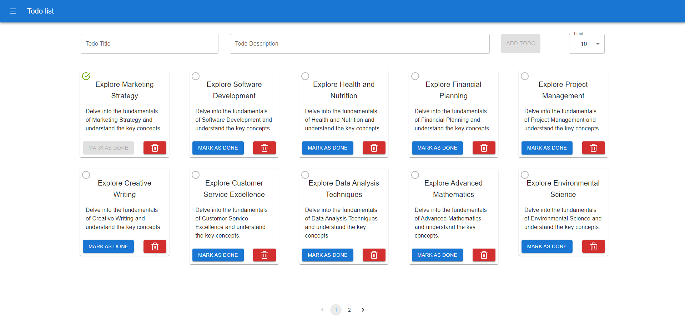

<<<<<<< HEAD

# Full-Stack Todo List Application

This repository hosts a full-stack Todo List application designed to allow users to create, manage, and organize their tasks efficiently. The application features a React-based frontend and a Node.js backend, utilizing MongoDB for data persistence.

## Technologies Used

- **Frontend**: React, Material-UI
- **Backend**: Node.js, Express
- **Database**: MongoDB
- **Other Tools**: Vite, React Toastify, Lucide Icons

## Features

- Create, view, update, and delete todo items.
- Organize tasks with tags/categories.
- Responsive user interface adaptable to different screen sizes.
- Real-time updates without page reloads.

## Contributing

Contributions are welcome! See the specific README files in the `frontend/` and `backend/` directories for more details on contributing.

## Snapshots

=======
# fullstack-todolist
A responsive MERN-based Todo app that lets users add, update, and delete tasks with real-time backend integration. Built with MongoDB, Express, React, and Node.js for seamless task management and clean UI.
